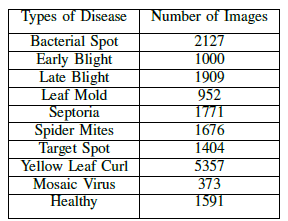

# DCGAN-for-Data-Augmentation-Tomato-Leaves
Here, the classification performance of deep learning models will be tested for both raw and augmented dataset in the context of Tomato Leaf Disease Dataset. Deep Convolutional Generative Adversarial Networks (DCGAN) will be used for data augmentation. Shown below is the overall methodology of the study:

# Data Gathering and Preprocessing
The dataset that will be used in the study is the PlantVillage Dataset obtained in https://github.com/spMohanty/PlantVillage-Dataset/tree/master. Here, only tomato leaves will be considered in the study. Summarized in the table below the type of tomato leaf disease and its corresponding number of images in the dataset.

