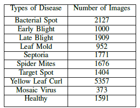
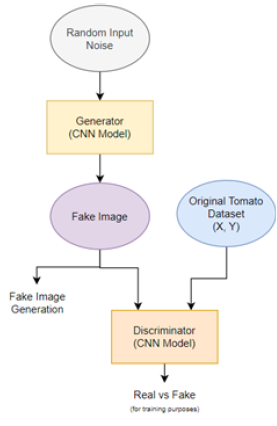

# DCGAN-for-Data-Augmentation-Tomato-Leaves
Here, the classification performance of deep learning models will be tested for both raw and augmented dataset in the context of Tomato Leaf Disease Dataset. Deep Convolutional Generative Adversarial Networks (DCGAN) will be used for data augmentation. Fig. 1 shows the overall methodology of the study:

# Data Gathering and Preprocessing
The dataset that will be used in the study is the PlantVillage Dataset obtained in https://github.com/spMohanty/PlantVillage-Dataset/tree/master. Here, only tomato leaves will be considered in the study. Summarized in Table 1 below the type of tomato leaf disease and its corresponding number of images in the dataset.

Since the computing machine used is limited, all tomato leaf images were load with a dimension of 64x64x3, wherein 3 represents the RGB spectrum of the color channel. Image pixels were then scaled to [0,1] and were normalized with mean of 0.5 and variance of 0.5 across individual images. Then, the whole dataset was divided using stratification wherein 85% went to the training and validation dataset and 15% went to the testing dataset. The training and validation dataset was used in the Data Augmentation and Deep Learning Training processes. Meanwhile, the testing dataset was solely used in the metrics evaluation for real-world generalization.

# DCGAN based Data Augmentation
A DCGAN was implemented for each tomato classes separately. The architectures for 10 individual DCGAN were similar, and only the number of epochs and the learning rate were served as hyperparameters for model tuning purposes. Fig. 2 below shows the DCGAN architecture for all classes

