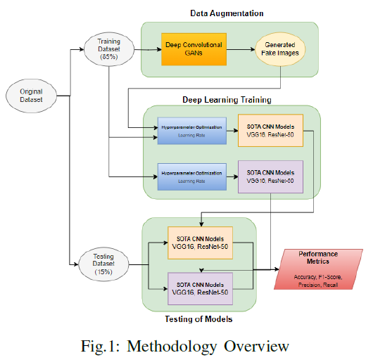

# DCGAN-for-Data-Augmentation-Tomato-Leaves
Here, the classification performance of deep learning models will be tested for both raw and augmented dataset in the context of Tomato Leaf Disease Dataset. Deep Convolutional Generative Adversarial Networks (DCGAN) will be used for data augmentation. Shown below is the overall methodology of the study:

