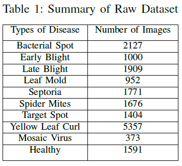

# DCGAN-for-Data-Augmentation-Tomato-Leaves
Here, the classification performance of deep learning models will be tested for both raw and augmented dataset in the context of Tomato Leaf Disease Dataset. Deep Convolutional Generative Adversarial Networks (DCGAN) will be used for data augmentation. Figure below shows the overall methodology of the study:

# Data Gathering and Preprocessing
The dataset that will be used in the study is the PlantVillage Dataset obtained in https://github.com/spMohanty/PlantVillage-Dataset/tree/master. Here, only tomato leaves will be considered in the study. Summarized in Table below the type of tomato leaf disease and its corresponding number of images in the dataset.

Since the computing machine used is limited, all tomato leaf images were load with a dimension of 64x64x3, wherein 3 represents the RGB spectrum of the color channel. Image pixels were then scaled to [0,1] and were normalized with mean of 0.5 and variance of 0.5 across individual images. Then, the whole dataset was divided using stratification wherein 85% went to the training and validation dataset and 15% went to the testing dataset. The training and validation dataset was used in the Data Augmentation and Deep Learning Training processes. Meanwhile, the testing dataset was solely used in the metrics evaluation for real-world generalization.

# DCGAN based Data Augmentation
A DCGAN was implemented for each tomato classes separately. The architectures for 10 individual DCGAN were similar, and only the number of epochs and the learning rate were served as hyperparameters for model tuning purposes. Figure below shows the DCGAN architecture for all classes

The generator that was used is a deep convolutional neural network with 5 layers. A 1D array random input noise with length of 100 was considered as an input to the generator. The generator then converts this random input noise to a 64x64x3 tensor through a series of transposed 2D convolution, batch normalization, and rectified linear unit activation function. Meanwhile, the discriminator evaluates whether its input 64x64x3 image is a fake or a real image. A 5-layer deep convolutional neural network was used for the generator. Here, a series of 2D convolution, batch normalization, and leaky ReLU were applied to convert a high dimensional tensor to a binary classification. The two tables below summarizes the architecture of generator and discriminator

# Deep Learning Training
The deep learning models that were considered in the training and evaluation purposes are VGG-16 and ResNet-50 pre-trained models. Since the research application consists of 10 classes only, the last layer of VGG-16 was modified to have 10 neurons instead of 1000. Meanwhile, additional layer was added to ResNet-50 wherein the last layer has 128 input neurons and 10 output neurons. Only the fully connected layers of both VGG- 16 and ResNet-50 were trainable, and both the model’s convolutional layers were freeze. Summarized in Table below the training parameters for the two models.

# DCGAN-based Fake Image Generation
The tradeoff of number of epochs versus learning rate were observed for each DCGAN architecture per classes. Table below shows the accepted hyperparameters for each architecture to produce quality fake image

Meanwhile, figure below shows the real image and the generated fake image per class using their corresponding hyperparameters. Note that while fake images were quite blurry, it was generated using a 60x60x3 input image and the DCGAN output was also 60x60x3 due to computing resource limitations.

# Performance at Varying Learning Rate
Shown in two tables below the summary of validation accuracies of augmented and non-augmented dataset using VGG-16 and ResNet50. Results showed that validation accuracies for augmented dataset performed better compared to non-augmented dataset.

Lastly, Table below summarized the corresponding F1-score, accuracy, precision, and recall of the models on test set. In terms of model comparison, VGG-16 outperformed ResNet-50 on all performance metrics considering the same dataset.

